# Arquitetura — Robo-Markplaces

Esquema da arquitetura atual do robô de operação em marketplaces (chat, estoque, repricing, monitores de mercado, importação e alertas).

## Desenho (visão em camadas)

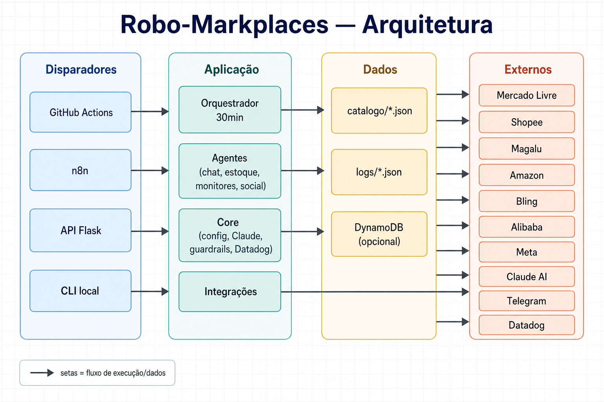

*Arquivo: [`docs/arquitetura-robo-markplaces.png`](arquitetura-robo-markplaces.png)*

## 1. Visão geral

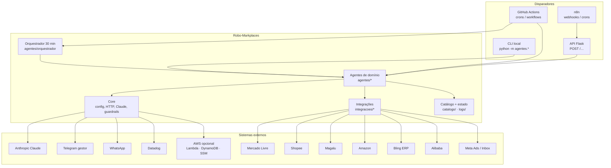

## 2. Camadas lógicas

| Camada | Pasta | Responsabilidade |
|--------|--------|------------------|
| Entrada | `api/`, `.github/workflows/`, `n8n/` | HTTP, crons CI, automações externas |
| Orquestração | `agentes/orquestrador/` | Ciclo periódico, registro de agentes, resumo |
| Domínio | `agentes/*` | Casos de uso (chat, monitor, estoque, social…) |
| Integração | `integracoes/*` | Clientes e parsers por sistema externo |
| Plataforma | `core/` | Config, HTTP, IA, métricas, kill switch, I/O atômico |
| Dados locais | `catalogo/`, `logs/` | Produtos, concorrentes, snapshots, histórico |
| Testes | `tests/` | Unitários dos fluxos críticos |

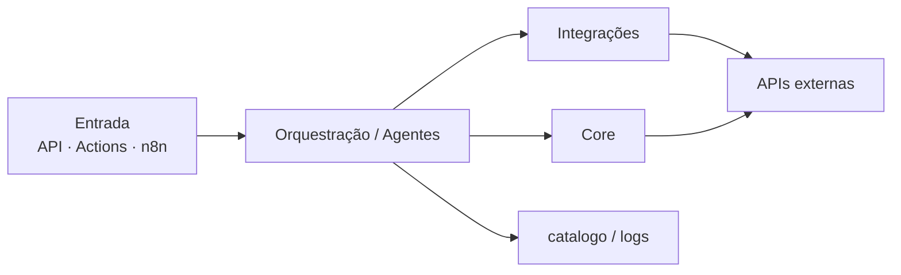

**Regra de dependência:** agentes chamam `integracoes` + `core`; integrações não devem conhecer agentes; `core` não depende de agentes.

## 3. Orquestrador e categorias de agentes

O orquestrador (`agente_orquestrador.py` + `registro_agentes.py`) executa o catálogo a cada ~30 min (workflow `orquestrador_30min.yml`), com pause entre agentes, métricas Datadog e resumo no Telegram.

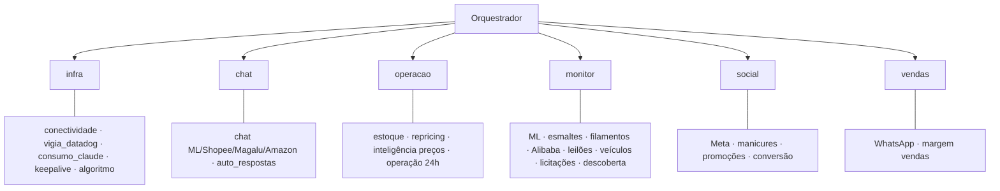

Agentes de escrita destrutiva ou rotinas diárias ficam de fora do ciclo de 30 min (ex.: publicador, relatório financeiro semanal) e rodam em workflows dedicados.

## 4. Fluxo operacional típico (marketplaces)

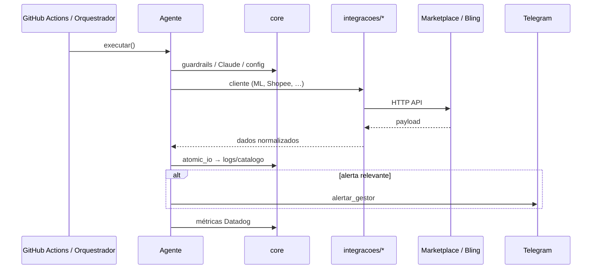

### Chat com IA

1. Agente de canal busca mensagens pendentes  
2. Resolve produto (Bling / catálogo / claim)  
3. Claude gera resposta contextualizada (`core/claude_*`)  
4. Envia resposta no marketplace (respeitando `ROBO_PAUSAR_ESCRITA`)

### Estoque

`Bling (saldo real) → catalogo/produtos.json → atualizar_estoque` em ML / Magalu / Shopee.

### Importação (ML × Alibaba)

`sinais ML → busca Alibaba (com meta coleta/anti-bot) → margem landed → veredito → Telegram`.

## 5. Integrações (mapa)

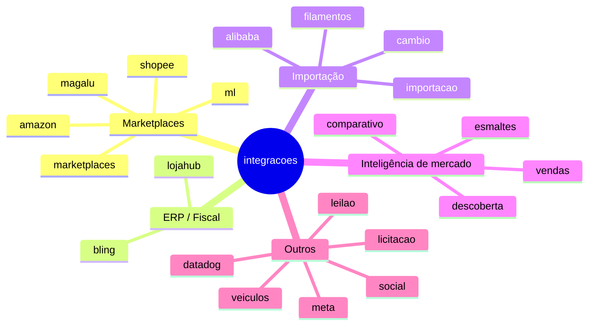

## 6. Plataforma (`core`) — serviços transversais

| Módulo | Função |
|--------|--------|
| `config.py` | Env vars e flags |
| `http_client.py` / `http_errors.py` | HTTP unificado + métricas |
| `claude_client.py` / `claude_orcamento.py` / `claude_toggle.py` | IA + orçamento + pause |
| `guardrails.py` | Kill switch de escrita |
| `notificador.py` / `telegram_*` | Alertas gestor |
| `datadog_metrics.py` / `datadog_logger.py` | Observabilidade |
| `token_manager.py` / `github_secrets.py` / `ssm_secrets.py` | Segredos e refresh |
| `atomic_io.py` / `state_backend.py` | Persistência segura (arquivo / DynamoDB) |
| `prontidao.py` | Checagem de credenciais |

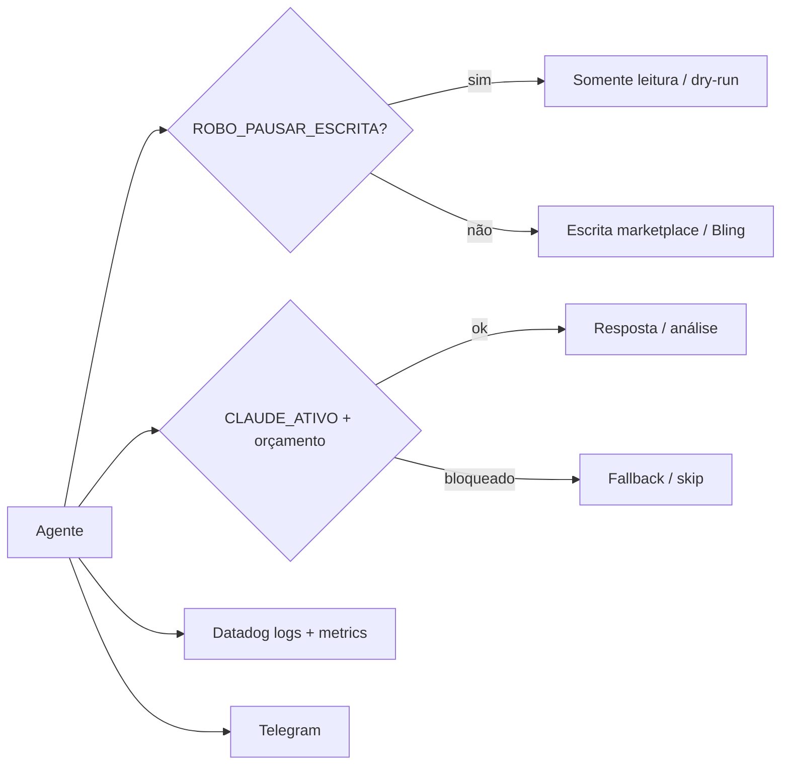

## 7. Persistência e estado

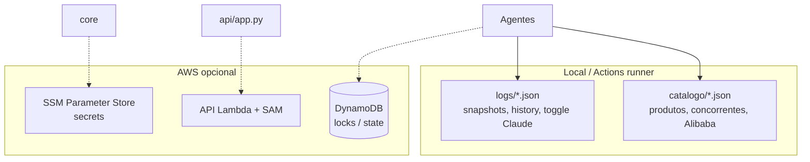

## 8. Observabilidade e operação

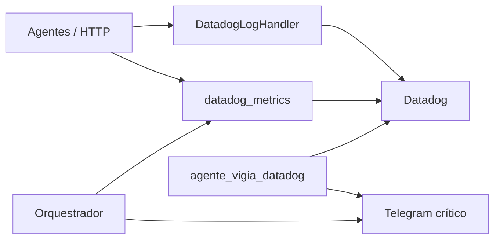

- Métricas com tags de baixa cardinalidade (`agente:`, `ok:`, `origem:`)  
- Vigia detecta erros e inatividade  
- Cooldown em alertas Telegram para evitar spam (`logs/alertas_cooldown.json`)

### 8.1 O que vai para o Telegram

Tudo passa por `core/notificador.py`. **Não vai JSON de pedido, token de marketplace nem dump de API.** Vai uma mensagem de texto (Markdown legado, até 4096 caracteres) para `https://api.telegram.org/bot{TELEGRAM_TOKEN}/sendMessage`.

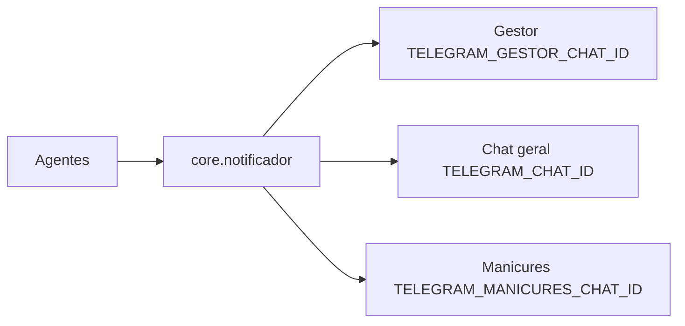

#### Payload HTTP

**Texto** (`_enviar`):

- `chat_id` — um dos três chats
- `text` — mensagem já montada (título + corpo)
- `parse_mode`: `Markdown` (se o Telegram rejeitar, reenvia o texto original sem formatação)

**Foto** (`_enviar_foto` / `enviar_foto_gestor`): `sendPhoto` com PNG/JPG e `caption` até 1024 caracteres (gráficos para o gestor).

**Confirmação Ads** (`perguntar_gestor_e_aguardar`): mesmo `sendMessage` + teclado inline SIM/NÃO (`callback_data`: `ads_sim` / `ads_nao`). Opcionalmente 1–2 linhas de contexto geradas pelo Claude a partir de um `contexto_decisao` (gatilho, sazonalidade) — **não o dict inteiro**.

Envelope que o notificador **sempre** prefixa:

- Gestor: `Gestor {data/hora BRT}` + corpo (`alertar_gestor`)
- Chat geral: `Alerta {data/hora BRT}` + corpo (`alertar`)
- Manicures: `Promo manicures {data/hora BRT}` + corpo (`enviar_telegram_manicures`)
- Crítico: `CRÍTICO` e pode ir **gestor + chat geral** se os IDs forem diferentes (`alertar_critico`)

Se `TELEGRAM_EXPLICACAO_AGENTES=1` (padrão), depois do título entram os blocos “O que este agente faz” e “Quando roda” (`core/telegram_explicacao.py`).

#### Três destinos

| Canal | Secret | Função |
|--------|--------|--------|
| Gestor | `TELEGRAM_GESTOR_CHAT_ID` | Quase todos os relatórios e alertas (`alertar_gestor`) |
| Chat geral | `TELEGRAM_CHAT_ID` | `alertar` / parte do `alertar_critico` |
| Manicures | `TELEGRAM_MANICURES_CHAT_ID` | Promoções (`enviar_telegram_manicures`) — não é o chat do gestor |

#### O que não vai no Telegram

- Token do bot não vai no texto; só na URL da API.
- Prompt, system e JSON enviados ao Claude **não** vão ao Telegram (só Datadog/logs locais).
- Venda nova do dia a dia: **WhatsApp**, não Telegram (`agentes/vendas_notificador.py`). Telegram só se a **busca de pedidos falhar** (auth quebrada ou API fora).
- Fatura/saldo Mercado Pago no resumo da conta: nota de que isso fica no painel, não no card.
- Agentes marcados “sem Telegram no cron” (ex.: `monitor_anita`, `resumo_diario_novamix`; `kits_concorrentes_unificado` só grava JSON).

#### Conteúdo típico por família (gestor)

Cada agente monta um **resumo em português**, com SKU, nome, preço, %, MLB, links e contagens — não o pedido completo.

- **Conta ML** (`integracoes/ml/resumo_conta.py`): nickname, seller_id, perguntas pendentes, anúncios a melhorar / ativos / pausados, Premium vs Clássico, sugestões de preço, Ads idle, envios, claims, reputação (cor, vendas, nota, claims rate, Mercado Líder).
- **Margem de vendas**: alerta por item abaixo do mínimo (produto, marketplace, valor, margem) + resumo do período.
- **Impala / esmaltes**: KPIs (kits % receita, margem), kits sem MLB, checklist, comparativo Anita, golpe de guerra, radar diferencial, kits sugeridos, busca de cores.
- **Manicures (grupo)**: texto de promoção de kits Impala (catálogo ML); o gestor pode receber pedido de SIM antes (`necessidade_manicures`).
- **Ads ML**: pergunta de confirmação antes de ligar/pausar/escalar Product Ads.
- **Ciclo 30 min** (`orquestrador`): consolidado do que passou/falhou — não o relatório completo de cada agente.
- **Operação / estoque / repricing**: snapshot ou falha de aplicação (contagens tipo `1/1`, SKUs).
- **Claude**: **não** vai prompt, contexto JSON nem a resposta completa da API. O digest 6h (`agente_consumo_claude`) manda US$ usado/restante, assertividade e gráficos. Com `CLAUDE_ORCAMENTO_ALERTA_TODAS=1` (padrão) também alerta a cada chamada (origem, modelo, custo). Limiar e hard-stop continuam. Alguns agentes ainda colam um **resumo curto** da síntese (operação 24h, playbook, confirmação Ads).
- **Datadog / conectividade**: erros, silêncio, falha de API.
- **Outros ramos** (quando o cron está ligado): leilão/FIPE, licitações, filamentos/Masterprint, CNPJ/CNAE, importação (formato texto de landed/porto — vários desses estão desligados no cron).

Para a API do Telegram vão só: **chat_id + texto** (e às vezes foto/legenda ou botões SIM/NÃO). O texto é um briefing operacional truncado em 4096 caracteres, com data BRT e (em geral) a explicação do agente.

## 9. Deploy e CI

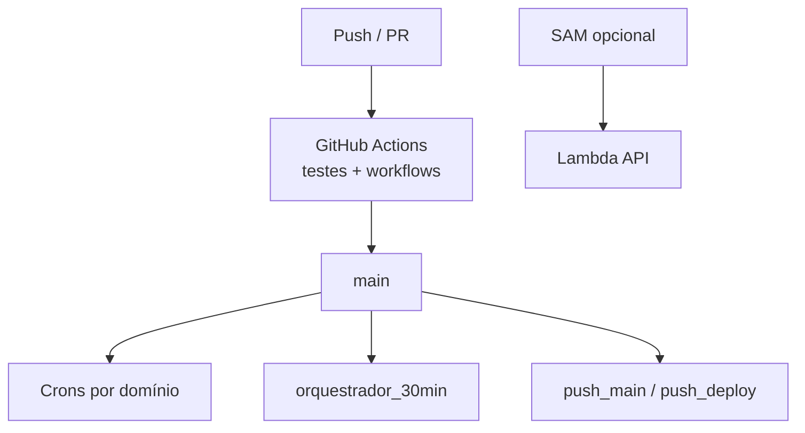

| Mecanismo | Uso |
|-----------|-----|
| Workflows em `.github/workflows/` | Agentes agendados (ML, esmaltes, Alibaba, estoque, tokens…) |
| `orquestrador_30min.yml` | Varredura ampla + resumo |
| Flask `api/app.py` | Entrada HTTP / n8n |
| `api/lambda_handler.py` | Deploy AWS opcional |

## 10. Domínios de negócio (resumo)

| Domínio | Exemplos de agentes | Integrações principais |
|---------|---------------------|-------------------------|
| Chat & atendimento | `agente_ml`, Shopee, Magalu, Amazon, auto_respostas | ML/Shopee/Magalu/Amazon, Bling, Claude |
| Preço & estoque | repricing, sync estoque, inteligência preços | Bling + canais |
| Esmaltes / manicures | Anita, kits, Impala, acetona, Meta, ecossistema, crescimento, decisão do dia, contrato impulso | ML, Meta, planilhas |
| Filamentos 3D | monitor filamentos + cruzamento Alibaba | ML, Alibaba, câmbio |
| Importação | Alibaba, ML×Alibaba, cálculo aéreo | Alibaba, ML, câmbio |
| Veículos / leilões | Sumaré, FIPE, carros batidos | scrapers / sites |
| Infra | vigia Datadog, consumo Claude, conectividade | Datadog, Anthropic |

## 11. Como estender

1. Lógica de API externa → `integracoes/<dominio>/`  
2. Caso de uso agendável → `agentes/<dominio>/agente_*.py` com `executar()`  
3. Registrar em `registro_agentes.py` (se for no ciclo de 30 min) e/ou criar workflow em `.github/workflows/`  
4. Flags em `core/config.py` + `.env.exemplo`  
5. Testes em `tests/`  
6. Alertas via `core.notificador.alertar_gestor`

---

*Documento vivo: atualizar quando novas camadas, canais ou fluxos críticos forem adicionados.*
